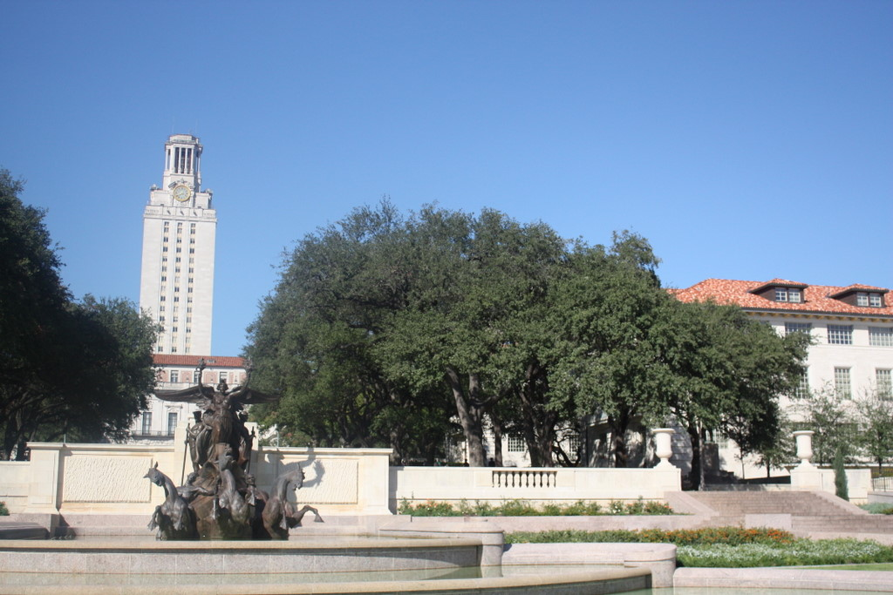
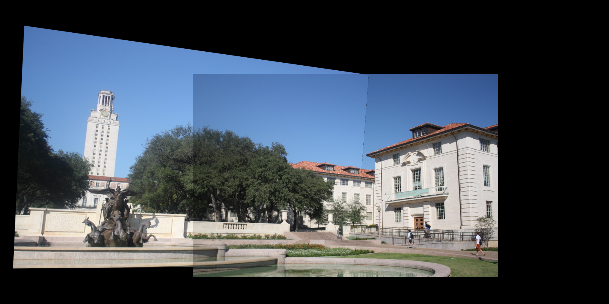
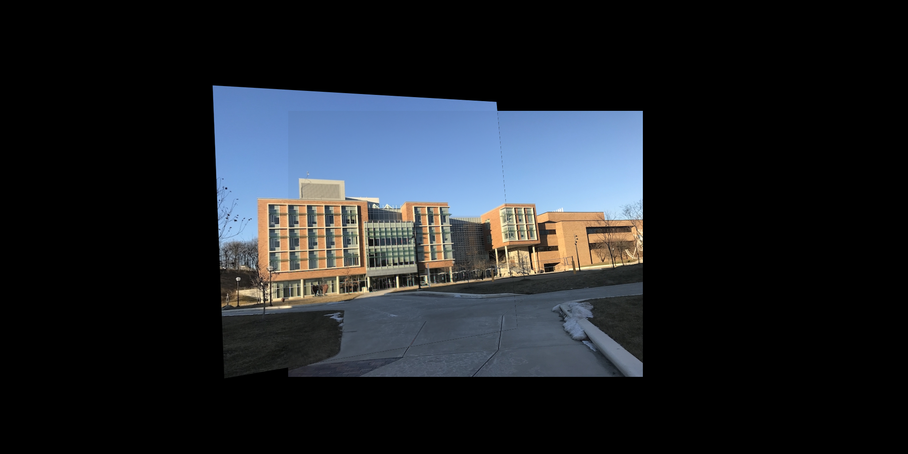

# Image-Stitching

This project implements panorama stitching by aligning two images with overlapping fields of view using feature detection, matching, and homography estimation.

## Implementation

### 1. Image Loading & Preprocessing
- Loaded `uttower_left.jpg` and `uttower_right.jpg`
- Converted to grayscale and `double` format
- Displayed grayscale images

### 2. Feature Detection
- Used SIFT/SURF descriptors to detect keypoints
- Visualized images with detected feature points

### 3. Descriptor Distance Calculation
- Computed pairwise descriptor distances using: [YOUR CHOICE: Euclidean/Normalized Correlation/etc.]
- Normalization approach: [DESCRIBE YOUR NORMALIZATION METHOD]

### 4. Putative Matches Selection
- Match selection method: [RATIO TEST/THRESHOLD/TOP N]
- Parameters used: [SPECIFY THRESHOLD/N VALUE/RATIO]
- Number of initial matches: [X]

### 5. RANSAC Homography Estimation
- Implemented RANSAC from scratch
- Number of inliers: [X]
- Average residual for inliers: [Y] pixels
- Displayed inlier matches using `cv2.drawMatches`

### 6. Image Warping
- Applied estimated homography with `cv2.warpPerspective`
- Successfully warped one image to align with the other

### 7. Panorama Creation
- Created composite image with proper dimensions
- Used averaging in overlapping regions
- Final stitched output matches expected result

### 8. BBB Images Test
- Successfully processed `bbb_left.jpg` and `bbb_right.jpg`
- Displayed all intermediate results:
  - Feature points
  - Initial matches
  - Inlier matches
  - Final stitched image

## Input Images

### UT Tower Images
| Left Image | Right Image |
|------------|-------------|
|  |  |

### BBB Images
| Left Image | Right Image |
|------------|-------------|
|  |  |

## Results

### UT Tower Images

### BBB Images
